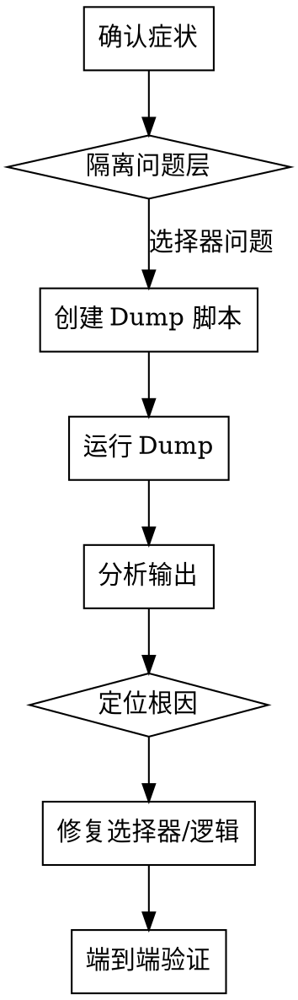

# 调试网页爬虫选择器

## 核心理念

**不要猜，去页面里看。**

选择器失效时，最常见的错误是凭经验猜测新选择器然后反复试错。正确做法是：让浏览器告诉你页面的真实结构。

## 何时使用

- 爬虫日志出现 "未找到 XX 按钮"、"评论数为 0"、"抓取 0 条"
- 抓到的数据不是目标内容（如把促销文字当成评分）
- 分页/翻页失败，只能看到第一页
- 网站改版后爬虫全面失效
- **不要用于**：网络错误、风控封锁、登录失败——这些不是选择器问题

## 思维流程



## 第一步：确认症状，隔离问题层

在写任何调试代码之前，先从日志中精确定位失败层：

| 日志线索 | 问题层 | 典型原因 |
|---------|--------|---------|
| "未找到 XX 按钮" | 定位层 | 选择器 class hash 变了 |
| 评论数正确但抓到 0 条 | 提取层 | 卡片选择器失效 |
| 抓到错误文本（如促销语） | 定位层 | 选择器太宽泛，匹配到多个元素 |
| 只看到第一页 | 导航层 | 翻页按钮选择器/点击方式失效 |
| 总数 189 但只抓 15 | 导航层 | "View All" 未成功跳转 |

**关键判断**：是选择器本身错了，还是选择器对了但交互（点击/滚动）失败？

## 第二步：创建 Dump 脚本

核心原则：**用和爬虫相同的浏览器环境（profile/cookie），但只做观察，不做业务逻辑。**

### 脚本模板

```bash
python "${CLAUDE_SKILL_DIR}/scripts/dump_page_structure.py" \
  --url "https://example.com/target-page" \
  --output-dir "./debug_output" \
  --auto
```

### 如果需要自定义脚本

当模板不适用时（特殊登录、SPA 应用等），按以下结构创建：

```python
# 核心结构（伪代码）
driver = create_driver_with_same_profile()  # 复用爬虫的 profile
driver.get(target_url)
wait_for_page_ready()

# 用 JS 一次性收集所有结构信息
analysis = driver.execute_script("""
    return {
        reviewClasses: findAllClassesMatching(/review/i),
        targetElements: querySelectorAll('[class*=\"target\"]'),
        firstCardHTML: firstCard?.outerHTML?.substring(0, 3000),
        paginationElements: findAllPagination(),
    }
""")

# 保存到文件（不要只 print，会被日志截断）
save_to_file(analysis)
save_page_source(driver.page_source)
save_screenshot()
```

### 必须分析的 8 个维度

在 JS 分析脚本中，覆盖以下维度：

| 维度 | 查什么 | 为什么重要 |
|------|--------|-----------|
| 1. 相关 CSS class | `className` 包含关键词的所有元素 | 找到真实 class hash |
| 2. 目标按钮/链接 | 按文本 + tag 组合搜索 | 确认按钮是否存在、用什么 tag |
| 3. 评论/数据卡片 | 多个选择器策略探测 | 确认卡片容器 class |
| 4. 总数文本 | 带关键词的容器 | 确认数字在哪个元素里 |
| 5. 翻页元素 | `aria-label`, `class*="paginat"`, `href*="page"` | 确认翻页是按钮还是链接 |
| 6. 区域容器 | 大范围容器 class | 理解 DOM 层级关系 |
| 7. 遮挡元素 | cookie 弹窗、modal、overlay | 找出"元素存在但点不到"的原因 |
| 8. 完整 page_source | 整页 HTML | 深度分析时的后备 |

## 第三步：运行 Dump 并分析输出

### 运行策略

1. **先跑目标页面**（日志里报错的那个 URL）
2. **再跑关联页面**（如从商品页跳转到的独立评论页）
3. **两个页面的结构可能不同** — 翻页往往在独立页面上才有

### 分析方法

读 dump 文件时，按这个顺序：

```
1. 看截图 → 确认页面加载正常、有无弹窗遮挡
2. 看维度 7（遮挡元素）→ 有 cookie banner？有 modal？
3. 看维度 2（目标按钮）→ 按钮存在吗？class 是什么？
4. 看维度 4（卡片）→ 有几个？class 是什么？
5. 看维度 5（翻页）→ 找得到 Next 按钮吗？aria-label 是什么？
```

### 常见根因模式

| dump 中的发现 | 根因 | 修复方向 |
|--------------|------|---------|
| 按钮 HTML 存在，但截图中被半透明层覆盖 | cookie banner / modal 遮挡 | 先关闭弹窗再操作 |
| 按钮存在，`aria-disabled="false"`，但点击报错 "not clickable" | skeleton 加载层遮挡 | JS 强制点击 `execute_script("arguments[0].click()")` |
| class hash 变了（如 `_viewMore_pmj7w_7` → `_viewMore_pmj7w_12`） | CSS Modules 重新编译 | 用通配符 `[class*='_viewMore_pmj7w']` |
| 选择器匹配到多个元素，第一个不是目标 | 选择器太宽泛 | 缩小范围或用更精确的父容器限定 |
| 按钮只在另一个页面存在 | 当前页面没有这个功能 | 直接构造目标 URL 导航 |
| 总数文本里没有数字 | 数字和文本在不同元素中 | 换选择器或用 JS 从更上层容器提取 |

## 第四步：修复选择器

### 选择器设计原则

```
1. 用 [class*='部分class'] 而非完整 class（CSS Modules hash 会变）
2. 用子串匹配最短的稳定部分（如 '_noonReviewItem_' 而非 '_noonReviewItem_1oceu_29'）
3. 不要匹配 skeleton/loading 专用 class（如 _skeletonWrapper_uaefh）
4. 优先用语义属性（aria-label, role, data-*）而非 class
```

<Good>
```python
# 用 class 的稳定前缀
"review_card": "[class*='_noonReviewItem_']"
# 用 aria-label（不会因 CSS 编译变化）
"pagination_next": "a[aria-label='Next page']:not([aria-disabled='true'])"
```
</Good>

<Bad>
```python
# 包含 hash 后缀，CSS 重新编译后就失效
"review_card": "[class*='_noonReviewItem_1oceu_29']"
# 太宽泛的 class，页面上到处都是
"rating_avg": "[class*='_skeletonWrapper_uaefh']"
```
</Bad>

### 点击交互修复

当选择器正确但点击失败时，逐级升级：

```python
# Level 1: Selenium 原生点击（最真实但容易被遮挡）
element.click()

# Level 2: JS 强制点击（绕过遮挡层）
driver.execute_script("arguments[0].click();", element)

# Level 3: 直接 URL 导航（完全绕过交互）
driver.get(f"https://example.com/target-page/{id}/")
```

### 提取文本修复

当 Selenium `.text` 返回空时（元素不在视口），用 JS 直接读：

```python
# Selenium 方式（依赖视口可见）
text = element.text

# JS 方式（不依赖视口，直接读 DOM）
text = driver.execute_script(
    "var el = document.querySelector(arguments[0]);"
    "return el ? el.textContent.trim() : '';",
    selector
)
```

## 第五步：端到端验证

修复后，用**完整数据量**验证，不是只看"不报错"：

```
验证清单：
[ ] 之前抓 15 条的商品现在抓到全部（如 189 条）
[ ] 翻页日志显示多页（如 "13 页"）
[ ] 平均分数是数字（如 "4.4"），不是促销文本
[ ] 评分总数是正确数字（如 "1271"，不是 "1"）
[ ] 飞书表格中数据完整
[ ] 多个商品跑一遍，不止测一个
```

## 常见错误

| 错误 | 正确做法 |
|------|---------|
| 看到 class hash 变了就全局替换 hash | 用 `*=` 通配匹配，不写死 hash |
| 猜测新选择器然后试 | 先 dump 页面看真实结构 |
| 只测一个商品就认为修好了 | 至少测 3 个不同商品（少量/中量/大量评论） |
| 只看"不报错"就认为成功 | 检查实际抓到的数据条数和内容 |
| 忽略 cookie banner | 它是最常见的"元素存在但点不到"的原因 |
| 在商品页上找评论总数 | 独立评论页的数据通常更完整 |
| `(\d+)` 正则匹配 "1,271" | 用 `([\d,]+)` + `.replace(",", "")` |

## 红线

```
不要在没有 dump 验证的情况下批量修改选择器
不要假设两个页面用同一套选择器
不要忽略 UnicodeEncodeError —— 它可能隐藏了真实数据
```
